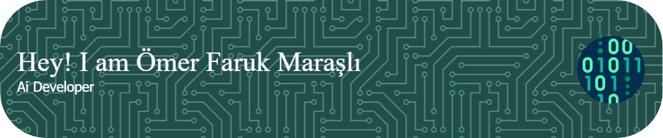

<h1 align="center">Hi 👋, I'm Ömer Faruk Maraşlı</h1>
<h3 align="center">A passionate high school student striving to shape the future with innovative ideas.</h3>

- 🔭 I’m currently working on **LEYKENT**

- 🌱 I’m currently learning **generative ai**

- 📫 How to reach me **omerfarukmarasli.cont@gmail.com**

<h3 align="left">Connect with me:</h3>

<h3 align="left">Languages and Tools:</h3>

            

&nbsp;

# 💻 Languages and Tools:

